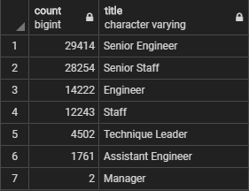

# Pewlett Hackard Analysis

## Challenge Overview
You are to determine the number of retiring employees per job title and identify employees who are eligible to participate in a mentorship program.

## Resources
- Data Source: departments.csv, dept_emp.csv, dept_manager.csv, employees.csv, salaries.csv, titles.csv
- Software: PostgreSQL 12.4, Visual Studio Code 1.47.2

## Challenge Results
From our analysis, we can see that:

- Many retirees are in a senior role.
- Only 2 managerial positions are retiring.
- Scrolling down our mentorship_eligibility.csv file, there are about 1549 employees who can become mentors.
- There is a healthy amount of mentors available in each role.

## Challenge Summary

Number of Eligible Mentors per Title | Number of Employees Not Retiring per Title
:-----------------------------------:|:------------------------------------------:
 | 

If we sum up the counts in retiring_titles.csv, there are 90,398 employees that will be retiring. Which means 90,398 roles will need to be filled as the "silver tsnuami" begins to make an impact. Looking at the above table, we can see that there are plenty of mentors available to help the new hires.

